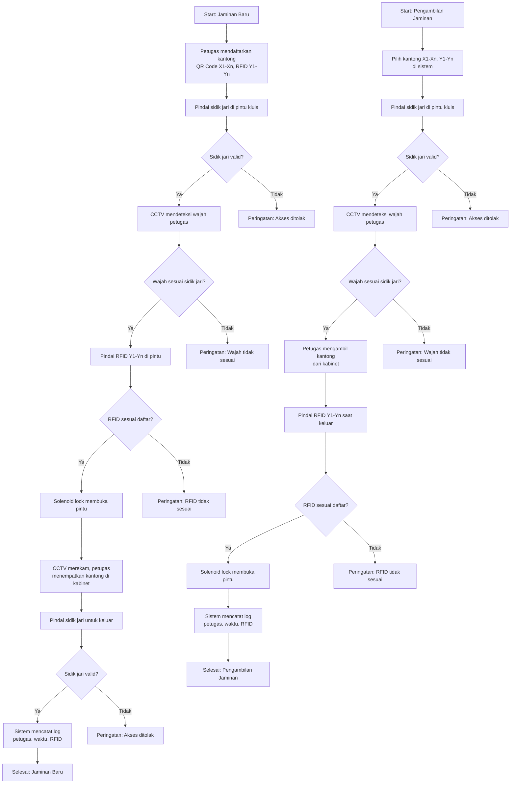

# Sistem Keamanan Pegadaian

Proyek ini mengimplementasikan sistem keamanan untuk ruang kluis pegadaian, mengintegrasikan **QR Code**, **RFID**, **autentikasi sidik jari**, **CCTV dengan pengenalan wajah**, dan **kontrol akses berbasis IoT**. Sistem dirancang untuk menangani hingga 10 kantong barang jaminan dalam satu transaksi, dengan anggaran Rp15 juta per kluis.

## Daftar Isi
1. [Gambaran Umum](#gambaran-umum)
2. [Kebutuhan Perangkat Keras](#kebutuhan-perangkat-keras)
3. [Alur Kerja Sistem](#alur-kerja-sistem)
4. [Input ke Sistem](#input-ke-sistem)
5. [Output Sistem](#output-sistem)
6. [Pemeliharaan](#pemeliharaan)
7. [Lisensi](#lisensi)
8. [Peningkatan di Masa Depan](#peningkatan-di-masa-depan)
9. [Kontak](#kontak)

## Gambaran Umum
Sistem Keamanan Pegadaian mengamankan penyimpanan dan pengambilan barang jaminan di kluis menggunakan:
- **QR Code** untuk identifikasi kantong secara manual.
- **RFID** untuk pelacakan kantong otomatis tanpa kontak.
- **Sensor Sidik Jari** untuk autentikasi petugas.
- **CCTV dengan Pengenalan Wajah** untuk identifikasi petugas secara real-time.
- **Orange Pi 5 Ultra** sebagai pusat kontrol dengan NPU 6 TOPS untuk inferensi AI.
- **Solenoid Lock** untuk mengamankan pintu kluis.

Sistem mendukung dua proses utama:
- **Jaminan Baru**: Menyimpan barang jaminan ke kluis.
- **Pengambilan Jaminan**: Mengambil barang jaminan dari kluis.

## Kebutuhan Perangkat Keras
Berikut daftar perangkat keras untuk prototipe, beserta fungsi dan estimasi biaya (total: Rp9,8 juta).

| **Komponen**                     | **Biaya (Rp)** | **Fungsi**                                                                 |
|----------------------------------|----------------|---------------------------------------------------------------------------|
| Orange Pi 5 Ultra (16GB)         | 3.000.000      | Pusat kontrol untuk monitoring, inferensi AI (pengenalan wajah, deteksi orang), dan integrasi RFID, sidik jari, serta solenoid lock. |
| Kamera Resolusi Tinggi (1080p)   | 2.000.000      | Merekam video CCTV dan mendukung pengenalan wajah menggunakan YOLOv8 Nano dan library *face_recognition*. |
| RFID Reader + 100 Tag (RC522)    | 1.000.000      | Mengidentifikasi dan memverifikasi hingga 10 kantong secara otomatis melalui tag RFID di pintu kluis. |
| Sensor Sidik Jari (R307)         | 400.000        | Mengautentikasi petugas yang masuk/keluar kluis, memastikan hanya personel berwenang yang diizinkan. |
| Solenoid Lock                    | 500.000        | Mengamankan pintu kluis, hanya terbuka setelah verifikasi sidik jari, wajah, dan RFID. |
| Segel Plastik (100 unit)         | 200.000        | Memberikan segel anti-rusak untuk kantong, dengan nomor seri unik untuk verifikasi manual. |
| Lampu LED                        | 200.000        | Meningkatkan pencahayaan di kluis untuk akurasi pengenalan wajah di kondisi minim cahaya. |
| UPS (Uninterruptible Power Supply)| 1.000.000      | Menjamin keandalan sistem saat listrik padam, melindungi data dan kontrol akses. |
| Instalasi & Konfigurasi          | 1.500.000      | Mencakup pengaturan, integrasi perangkat lunak, dan pengujian awal sistem. |
| **Total**                        | **9.800.000**  |                                                                           |

**Catatan**:
- **Orange Pi 5 Ultra** digunakan untuk performa AI yang cepat berkat NPU 6 TOPS, menggantikan Raspberry Pi 4.
- Sisa anggaran (Rp5,2 juta) dapat digunakan untuk upgrade seperti NVMe SSD (Rp1 juta untuk 256GB) atau RFID reader tambahan.

## Alur Kerja Sistem
Alur kerja sistem digambarkan dalam flowchart berikut, menggunakan sintaks **Mermaid** untuk renderring langsung di GitHub.

### Flowchart

### Detail Alur Kerja
Sistem mendukung dua proses: **Jaminan Baru** dan **Pengambilan Jaminan**, dengan kemampuan menangani hingga 10 kantong (QR Code X1-Xn, RFID Y1-Yn).

#### Jaminan Baru
1. **Pendaftaran Kantong**:
   - Petugas memindai QR Code (X1-Xn) dengan webcam dan tag RFID (Y1-Yn) dengan RC522 di meja kasir. Data disimpan di SQLite pada Orange Pi 5 Ultra.
   - **QR Code Batch**: Opsional, satu QR Code mewakili beberapa kantong untuk mempercepat verifikasi di pintu kluis.

2. **Autentikasi Sidik Jari**:
   - Petugas memindai sidik jari di pintu kluis menggunakan sensor R307.

3. **Pengenalan Wajah**:
   - Kamera 1080p merekam wajah petugas. YOLOv8 Nano mendeteksi orang, dan library *face_recognition* (dioptimalkan untuk NPU Orange Pi) memverifikasi wajah terhadap database petugas.
   - Jika wajah tidak sesuai, pintu tetap terkunci.

4. **Verifikasi RFID**:
   - Pembaca RFID di pintu mendeteksi tag Y1-Yn secara otomatis. Sistem memastikan semua tag sesuai daftar terdaftar.

5. **Akses Kluis**:
   - Jika semua verifikasi valid, solenoid lock membuka pintu. CCTV merekam, dan petugas menempatkan kantong di kabinet.

6. **Keluar dan Pencatatan**:
   - Petugas memindai sidik jari untuk keluar. CCTV memverifikasi wajah lagi.
   - Sistem mencatat identitas petugas, waktu, dan daftar RFID di SQLite.

#### Pengambilan Jaminan
1. **Pilih Kantong**:
   - Petugas memilih kantong (X1-Xn, Y1-Yn) melalui antarmuka Flask di Orange Pi.

2. **Autentikasi Sidik Jari dan Wajah**:
   - Sama seperti Jaminan Baru, verifikasi sidik jari dan wajah di pintu kluis.

3. **Ambil Kantong**:
   - Petugas mengambil kantong dari kabinet, memverifikasi QR Code secara manual (atau dengan QR Code Batch).

4. **Verifikasi RFID Saat Keluar**:
   - Pembaca RFID memverifikasi tag Y1-Yn sesuai daftar pengambilan.

5. **Pencatatan**:
   - Sistem mencatat identitas petugas, waktu, dan daftar RFID. CCTV berhenti merekam saat pintu tertutup.

**Catatan Khusus**:
- **QR Code Batch**: Dihasilkan saat pendaftaran untuk mewakili beberapa kantong, mengurangi waktu pemindaian di pintu kluis.
- **Pengenalan Wajah**: Didukung NPU 6 TOPS Orange Pi, memproses wajah dalam <0,5 detik.
- **Multi-Kantong**: RFID reader mendukung deteksi hingga 10 tag sekaligus.

## Input ke Sistem
Sebelum masuk ke kluis, petugas memberikan input berikut:
1. **Pendaftaran Kantong** (di meja kasir):
   - **QR Code (X1-Xn)**: Dipindai dengan webcam untuk mengidentifikasi setiap kantong.
   - **Tag RFID (Y1-Yn)**: Dipindai dengan RC522 untuk registrasi otomatis.
   - **Detail Barang**: Dimasukkan via antarmuka Flask (misalnya, jenis barang, pemilik, tanggal), disimpan di SQLite.
   - **QR Code Batch**: Opsional, dibuat untuk mewakili beberapa kantong.

2. **Autentikasi Petugas** (di pintu kluis):
   - **Sidik Jari**: Dipindai dengan sensor R307.
   - **Wajah**: Ditangkap oleh CCTV untuk pengenalan wajah.
   - **Tag RFID**: Dideteksi otomatis oleh pembaca RFID.

**Contoh**:
- Untuk 10 kantong, petugas memindai 10 QR Code dan 10 tag RFID di kasir, memasukkan detail (misalnya, “Emas, Pelanggan A, 06/06/2025”), dan membuat QR Code Batch. Di pintu kluis, petugas memindai sidik jari, dan sistem memverifikasi wajah serta RFID.

## Output Sistem
Sistem menghasilkan output berikut:
1. **Kontrol Akses**:
   - **Pintu Kluis**: Terbuka (via solenoid lock) jika sidik jari, wajah, dan RFID valid.
   - **Peringatan**: Ditampilkan di layar Orange Pi (misalnya, “Wajah tidak sesuai”, “RFID tidak terdaftar”) jika verifikasi gagal.

2. **Log**:
   - Disimpan di SQLite, mencakup:
     - Identitas petugas (dari pengenalan wajah).
     - Waktu masuk/keluar.
     - Daftar RFID (Y1-Yn) dan QR Code (X1-Xn).
     - Lokasi kabinet (entri manual).

3. **Rekaman CCTV**:
   - Video disimpan di penyimpanan Orange Pi (MicroSD atau NVMe SSD opsional), ditandai dengan identitas petugas dan waktu.

4. **Umpan Balik Real-Time**:
   - Antarmuka Flask menampilkan status verifikasi (misalnya, “Akses diberikan”, “10 kantong tervalidasi”).

**Contoh**:
- Saat masuk berhasil, sistem mencatat: “Petugas Budi masuk kluis pada 06/06/2025 14:02, dengan kantong Y1-Y10, ditempatkan di Kabinet A.” Jika RFID Y11 terdeteksi, peringatan muncul: “RFID Y11 tidak terdaftar.”

## Pemeliharaan
Untuk menjaga keandalan sistem:
1. **Perangkat Keras**:
   - **Kamera**: Bersihkan lensa setiap bulan untuk kualitas gambar. Periksa lampu LED untuk akurasi pengenalan wajah.
   - **Pembaca RFID**: Verifikasi jangkauan (1m untuk RC522) dan bersihkan dari debu.
   - **Sensor Sidik Jari**: Bersihkan permukaan sensor setiap minggu untuk menghindari kesalahan pembacaan.
   - **Solenoid Lock**: Periksa setiap bulan untuk keausan mekanis. Lumasi jika diperlukan.
   - **Orange Pi**: Pantau suhu (gunakan heatsink/fan) untuk mencegah overheating selama inferensi AI.
   - **UPS**: Uji baterai setiap 6 bulan, ganti setiap 2–3 tahun.

2. **Perangkat Lunak**:
   - Perbarui Orange Pi OS dan library (misalnya, *face_recognition*, OpenCV) setiap 3 bulan.
   - Cadangkan database SQLite setiap minggu ke penyimpanan eksternal.
   - Latih ulang model pengenalan wajah saat ada petugas baru.

3. **Pengujian**:
   - Lakukan pengujian bulanan untuk memverifikasi akurasi sidik jari, wajah, dan RFID.
   - Simulasikan skenario multi-kantong (misalnya, 10 kantong) untuk memastikan skalabilitas.

4. **Anggaran**: Alokasikan Rp500.000–1.000.000 per tahun untuk pemeliharaan (misalnya, penggantian baterai, pembaruan perangkat lunak).

## Lisensi
Proyek ini dilisensikan di bawah **MIT License**. Lihat file `LICENSE` untuk detail.

## Peningkatan di Masa Depan
1. **Scanner QR Portabel**: Tambahkan scanner QR genggam (Rp1 juta) untuk verifikasi cepat di dalam kluis.
2. **NVMe SSD**: Tambah penyimpanan (Rp1 juta untuk 256GB) untuk rekaman CCTV lebih besar dan akses database lebih cepat.
3. **Analisis Perilaku**: Implementasikan deteksi perilaku mencurigakan berbasis AI (misalnya, YOLOv8) jika anggaran bertambah.
4. **Server Terpusat**: Gunakan mini PC (misalnya, Intel N100, Rp2,5 juta) untuk mengelola beberapa kluis.
5. **Segel Pintar**: Ganti segel plastik dengan segel IoT anti-rusak untuk keamanan tambahan.

## Kontak
Untuk pertanyaan atau kontribusi, hubungi:
- **Pengelola**: Mr. Don
- **Asisten**: Bejo (bejo@xai.com)
- **GitHub Issues**: Buka isu di repositori ini untuk dukungan.
