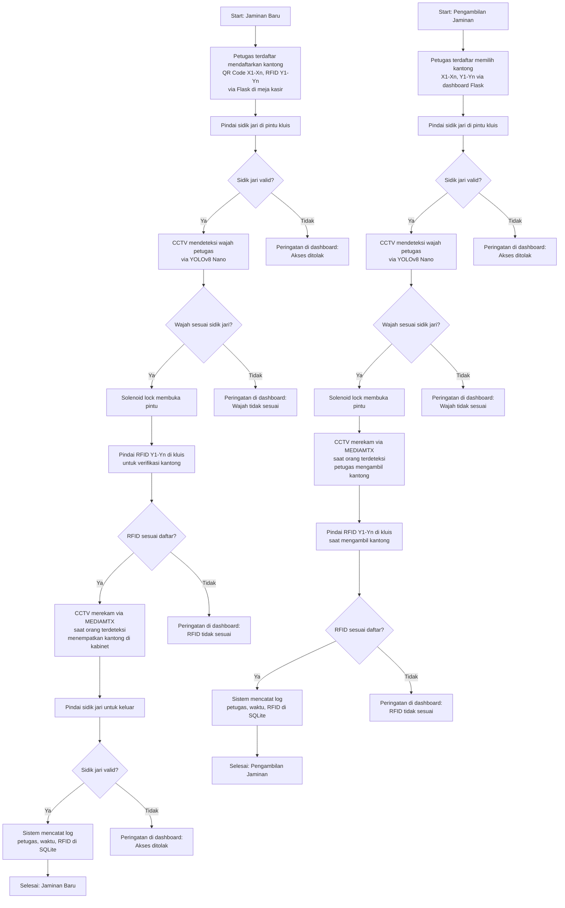

# Sistem Keamanan Pegadaian

Proyek ini mengimplementasikan sistem keamanan untuk ruang kluis pegadaian, mengintegrasikan **QR Code**, **RFID**, **autentikasi sidik jari**, **CCTV dengan pengenalan wajah**, dan **kontrol akses berbasis IoT**. Sistem dirancang untuk menangani hingga 10 kantong barang jaminan dalam satu transaksi, dengan anggaran Rp30 juta per kluis, dan terintegrasi dengan NVR existing untuk perekaman CCTV. Fokus utama adalah **Proof of Concept (PoC)** untuk memastikan keandalan sebelum ekspansi.

## Daftar Isi
1. [Gambaran Umum](#gambaran-umum)
2. [Kebutuhan Perangkat Keras](#kebutuhan-perangkat-keras)
3. [Alur Kerja Sistem](#alur-kerja-sistem)
4. [Input ke Sistem](#input-ke-sistem)
5. [Output Sistem](#output-sistem)
6. [Akses Output Sistem](#akses-output-sistem)
7. [Notifikasi Sistem](#notifikasi-sistem)
8. [Kemungkinan Error](#kemungkinan-error)
9. [Pemeliharaan](#pemeliharaan)
10. [Lisensi](#lisensi)
11. [Peningkatan di Masa Depan](#peningkatan-di-masa-depan)
12. [Model Bisnis](#model-bisnis)
13. [Kontak](#kontak)

## Gambaran Umum
Sistem Keamanan Pegadaian mengamankan penyimpanan dan pengambilan barang jaminan di kluis dengan teknologi mutakhir:
- **QR Code**: Identifikasi kantong, mendukung **QR Code Batch** untuk multi-kantong.
- **RFID**: Pelacakan dan verifikasi kantong otomatis di dalam kluis atau saat pendaftaran.
- **Sensor Sidik Jari**: Autentikasi petugas untuk akses pintu kluis.
- **CCTV dengan Pengenalan Wajah**: Identifikasi petugas real-time untuk akses pintu, terintegrasi dengan NVR via **MEDIAMTX**.
- **Orange Pi 5 Ultra**: Pusat kontrol lokal dengan NPU 6 TOPS untuk inferensi AI.
- **PC Server**: Dashboard Flask, pelatihan AI, dan database wajah terpusat.
- **Solenoid Lock**: Mengamankan pintu kluis, dikontrol berdasarkan sidik jari dan pengenalan wajah.

**Skenario Petugas (Skenario 1)**:
- Semua petugas yang bertanggung jawab untuk ruang kluis didaftarkan di awal (sidik jari via sensor R307 dan wajah via *face_recognition* dengan 10–20 foto per petugas).
- Petugas terdaftar dapat langsung mendaftarkan kantong (QR Code X1-Xn, RFID Y1-Yn) via dashboard Flask di meja kasir dan mengakses kluis dengan autentikasi sidik jari dan pengenalan wajah.
- Skenario ini dipilih untuk PoC karena efisiensi (akses cepat <2 menit per transaksi), kepraktisan (tidak memerlukan persetujuan tambahan), dan kesesuaian dengan pengujian autentikasi serta verifikasi kantong.

**Catatan PoC**:
- PoC menggunakan NVR terpisah.
- Stream RTSP dikelola oleh MEDIAMTX di Orange Pi, perekaman saat orang terdeteksi.
- Dashboard Flask di PC server menampilkan notifikasi dan log.

## Kebutuhan Perangkat Keras
Berikut daftar perangkat keras untuk PoC, total Rp30 juta. Mini PC kita skip, fokus ke PC Server yang lebih bertenaga!

| **Komponen**                     | **Biaya (Rp)** | **Fungsi**                                                                 |
|----------------------------------|----------------|---------------------------------------------------------------------------|
| Orange Pi 5 Ultra (16GB)         | 3.000.000      | Inferensi AI (YOLOv8 Nano, *face_recognition*), streaming RTSP via MEDIAMTX, integrasi sidik jari, solenoid lock, log SQLite. |
| Kamera RTSP (1080p, 120° FOV)    | 3.000.000      | Merekam video saat orang terdeteksi, mendukung YOLOv8 Nano dan *face_recognition*. |
| NVR (untuk PoC)                  | 1.000.000      | Menyimpan rekaman CCTV untuk PoC, kompresi H.264. |
| NVMe SSD 256GB                   | 1.000.000      | Penyimpanan log SQLite, embedding wajah, rekaman sementara. |
| RFID Reader + 100 Tag (RC522)    | 1.000.000      | Verifikasi kantong via RFID (jarak 1m) saat pendaftaran atau di kluis. |
| Sensor Sidik Jari (R307)         | 400.000        | Autentikasi petugas untuk akses pintu (<2 detik). |
| Solenoid Lock (12V, 5A)          | 500.000        | Mengamankan pintu kluis. |
| Segel Plastik (100 unit)         | 200.000        | Segel anti-rusak. |
| Lampu LED (5000K, 800 lumen)     | 200.000        | Pencahayaan untuk pengenalan wajah. |
| UPS (1000VA)                     | 1.000.000      | Keandalan saat listrik padam (2 jam). |
| Scanner QR Portabel              | 1.000.000      | Verifikasi QR Code di kluis. |
| PC Server (32GB RAM, Ryzen 5, GTX 1650) | 9.000.000 | Dashboard Flask, pelatihan AI batch, database wajah. |
| Pengembangan AI & Antarmuka (termasuk laporan) | 5.000.000 | Model *face_recognition*, skrip Flask pelatihan batch, laporan analitik. |
| Instalasi & Konfigurasi          | 2.000.000      | Setup MEDIAMTX, NVR, jaringan. |
| Cadangan Pengujian & *Fine-Tuning* | 1.700.000    | Pengujian PoC, simulasi 10 kantong. |
| **Total**                        | **30.000.000** |                                                                           |

**Catatan Anggaran**:
- Optional: Perangkat RFID bisa dipinjam dari pihak pegadaian untuk dilakukan ujicoba lebih lanjut.
- Anggaran tersebut merupakan perkiraan, bukan detail.
- Laporan analitik dimasukkan ke “Pengembangan AI & Antarmuka”, bukan saat PoC dan pembangunan tahap pertama.
- Cadangan pengujian dipangkas dari Rp2 juta ke Rp1,7 juta agar tetap Rp30 juta.

## Alur Kerja Sistem
Flowchart Mermaid untuk **Jaminan Baru** dan **Pengambilan Jaminan** (berdasarkan Skenario 1):

### Detail Alur Kerja
- **Jaminan Baru** (Skenario 1): 
  1. Petugas terdaftar mendaftarkan kantong (QR Code, RFID, detail barang) via Flask di meja kasir.
  2. Autentikasi petugas di pintu kluis via sidik jari dan pengenalan wajah.
  3. Pintu terbuka jika autentikasi valid.
  4. Verifikasi RFID kantong di dalam kluis untuk memastikan sesuai daftar.
  5. CCTV merekam, log disimpan di SQLite.
  6. Keluar kluis dengan autentikasi sidik jari.
- **Pengambilan Jaminan** (Skenario 1): 
  1. Petugas terdaftar memilih kantong via dashboard Flask.
  2. Autentikasi petugas via sidik jari dan wajah.
  3. Ambil kantong, verifikasi RFID di kluis.
  4. CCTV merekam, log disimpan.

## Input ke Sistem
- **Pendaftaran Kantong**: QR Code, RFID, detail barang via Flask oleh petugas terdaftar.
- **Autentikasi Petugas**: Sidik jari, wajah.
- **Verifikasi Kantong**: RFID di dalam kluis.

## Output Sistem
- **Kontrol Akses**: Pintu terbuka jika sidik jari dan wajah valid.
- **Log**: SQLite mencatat petugas, waktu, RFID kantong.
- **Rekaman CCTV**: Disimpan di NVR via MEDIAMTX.
- **Laporan Analitik**: Bulanan, dari log SQLite (akses kluis, deteksi *unknown*, waktu rata-rata), ekspor PDF/CSV.
- **Dashboard**: Umpan balik real-time.

## Akses Output Sistem
- **Petugas**: Lihat umpan balik di dashboard.
- **Supervisor**: Akses log, laporan, dan rekaman.
- **Tim IT**: Pemeliharaan dengan izin.
- **Auditor**: Akses untuk audit.
- **Pihak Berwenang**: Akses rekaman untuk investigasi.

## Notifikasi Sistem
Notifikasi di dashboard Flask:
- **Sidik Jari**: Valid/tidak valid.
- **Wajah**: Valid/tidak valid/unknown.
- **RFID Kantong**: Valid/tidak valid (saat verifikasi di kluis).
- **Deteksi Orang**: Log dan peringatan unknown.

## Kemungkinan Error
- Sidik jari gagal, pengenalan wajah gagal, RFID kantong gagal, kamera/NVR gagal, solenoid lock gagal, Orange Pi overheating.

## Pemeliharaan
- **Perangkat Keras**: Bersihkan perangkat, uji UPS, monitor suhu.
- **Perangkat Lunak**: Perbarui OS, AI, MEDIAMTX; cadangkan SQLite.
- **Pelatihan AI**: Batch 10 karyawan via skrip Flask di PC server (GPU GTX 1650).

## Lisensi
MIT License. Lihat `LICENSE`.

## Peningkatan di Masa Depan
Ide untuk masa depan:
- **Skenario 2: Penugasan Petugas per Akses Kluis**:
  - Menambahkan fitur di dashboard Flask untuk memungkinkan supervisor memilih petugas tertentu untuk setiap akses kluis (misalnya, via dropdown atau daftar shift).
  - Hanya petugas yang ditugaskan yang dapat masuk kluis, meningkatkan keamanan dan akuntabilitas.
  - Log SQLite diperluas untuk mencatat siapa yang menugaskan petugas, cocok untuk cabang besar atau kepatuhan ketat.
  - Integrasi dengan notifikasi eksternal (SMS/Telegram/WhatsApp) untuk persetujuan supervisor.
- Server terpusat untuk multi-kluis.
- Notifikasi eksternal (SMS/Email/Telegram/WhatsApp).
- Analisis perilaku dengan YOLOv8.
- Segel pintar berbasis NFC.
- Cloud backup SQLite.

## Kontak
- **Pengelola**: Jo
- **Asisten**: Bejo (bejo@donvirtus.net, WhatsApp: +62-xxx-xxx-xxxx)
