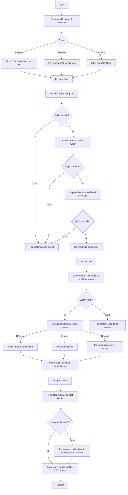

# Sistem Keamanan Pegadaian

Proyek ini mengimplementasikan sistem keamanan untuk ruang kluis pegadaian, mengintegrasikan **QR Code**, **RFID**, **autentikasi sidik jari**, **CCTV dengan pengenalan wajah**, dan **kontrol akses berbasis IoT**. Sistem dirancang untuk menangani hingga 10 kantong barang jaminan dalam satu transaksi, dengan anggaran Rp30 juta per kluis, dan terintegrasi dengan NVR untuk perekaman CCTV. Fokus utama adalah **Proof of Concept (PoC)** untuk memastikan keandalan sebelum ekspansi.

## Daftar Isi
1. [Gambaran Umum](#gambaran-umum)
2. [Kebutuhan Perangkat Keras](#kebutuhan-perangkat-keras)
3. [Alur Kerja Sistem](#alur-kerja-sistem)
4. [Input ke Sistem](#input-ke-sistem)
5. [Output Sistem](#output-sistem)
6. [Akses Output Sistem](#akses-output-sistem)
7. [Notifikasi Sistem](#notifikasi-sistem)
8. [Kemungkinan Error](#kemungkinan-error)
9. [Pemeliharaan](#pemeliharaan)
10. [Lisensi](#lisensi)
11. [Peningkatan di Masa Depan](#peningkatan-di-masa-depan)
12. [Model Bisnis](#model-bisnis)
13. [Kontak](#kontak)

## Gambaran Umum
Sistem Keamanan Pegadaian mengamankan penyimpanan dan pengambilan barang jaminan di kluis dengan teknologi mutakhir:
- **QR Code**: Identifikasi kantong.
- **RFID**: Deteksi pergerakan kantong di pintu kluis untuk memastikan hanya barang yang diizinkan yang masuk/keluar, dengan notifikasi untuk anomali.
- **Sensor Sidik Jari dan Face Recognition**: Autentikasi petugas untuk masuk (sensor & face recognition luar) dan keluar (sensor dan face recognition dalam) kluis.
- **CCTV dengan Pengenalan Wajah & People detection**: Identifikasi petugas real-time di dalam kluis (2 kamera), terintegrasi dengan NVR via **MEDIAMTX**.
- **Orange Pi 5 Pro RAM 4GB Rockchip RK3588S**: Pusat kontrol lokal dengan NPU 6 TOPS untuk inferensi AI (YOLOv8 Nano, *face_recognition*), streaming RTSP, dan log SQLite.
- **PC Server GMKTEC AMD Ryzen 7 7840HS**: Dashboard Flask, pelatihan AI batch, database wajah terpusat, penyimpanan Video AI (face recognition & people detection) ketika ada petugas di dalam ruang kluis.
- **Solenoid Lock**: Mengamankan pintu kluis, dikontrol berdasarkan sidik jari, wajah, dan QR Code (untuk Deposit/Retrieve).

**Skenario Petugas (Skenario 1)**:
- Semua petugas terdaftar di awal (sidik jari via R307, wajah via *face_recognition* dengan 10–20 foto per petugas).
- Petugas dapat memilih tujuan: Deposit (memasukkan barang), Retrieve (mengambil barang), atau Inspect (inspeksi tanpa barang).
- Untuk Deposit/Retrieve, petugas memindai QR Code batch di pintu. Untuk Inspect, hanya sidik jari dan wajah diperlukan.
- Skenario ini dipilih untuk PoC karena efisiensi, kepraktisan, dan kesesuaian dengan pengujian autentikasi serta deteksi RFID.

**Fitur Tambahan**:
- **Multi-Petugas**: Sistem mendukung beberapa petugas di kluis bersamaan, dengan CCTV memverifikasi wajah masing-masing.

**Catatan PoC**:
- PoC menggunakan NVR terpisah untuk perekaman CCTV.
- Stream RTSP dikelola oleh MEDIAMTX di Orange Pi, perekaman hanya saat orang terdeteksi.
- Dashboard Flask menampilkan notifikasi real-time dan log untuk audit.

## Kebutuhan Perangkat Keras
Berikut daftar perangkat keras untuk PoC, total Rp30 juta:

| **Komponen**                     | **Biaya (Rp)** | **Fungsi**                                                                 |
|----------------------------------|----------------|---------------------------------------------------------------------------|
| Orange Pi 5 Ultra (16GB) + NVMe SSD 256GB| 3.000.000      | Inferensi AI (YOLOv8 Nano, *face_recognition*), streaming RTSP via MEDIAMTX, integrasi sidik jari, solenoid lock, log SQLite. |
| Kamera RTSP (1080p, 120° FOV, 2 unit) | 3.000.000 | Perekaman di kluis, verifikasi wajah real-time. |
| NVR (untuk PoC)                  | 1.000.000      | Menyimpan rekaman CCTV, kompresi H.264. |
| RFID Reader + 100 Tag (RC522)    | 1.000.000      | Deteksi kantong masuk/keluar di pintu kluis (jarak 1m). |
| HIKVISION DS-K1T321MFWX          | 1.200.000       | Autentikasi petugas (1 luar untuk masuk, 1 dalam untuk keluar, <2 detik). |
| Solenoid Lock (12V, 5A)          | 500.000        | Mengamankan pintu kluis. |
| Segel Plastik (100 unit)         | 200.000        | Segel anti-rusak untuk kantong. |
| UPS (1000VA)                     | 1.000.000      | Keandalan saat listrik padam (2 jam). |
| Scanner QR Portabel              | 1.000.000      | Verifikasi QR Code di pintu kluis. |
| PC GMKTEC AMD Ryzen 7 7840HS | 9.000.000 | Dashboard Flask, pelatihan AI batch, database wajah. |
| Pengembangan AI & Antarmuka (termasuk laporan) | 5.000.000 | Model *face_recognition*, skrip Flask, laporan analitik. |
| Instalasi & Konfigurasi          | 2.000.000      | Setup MEDIAMTX, NVR, jaringan. |
| Cadangan Pengujian & *Fine-Tuning* | 1.300.000    | Pengujian PoC, simulasi 10 kantong. |
| **Total**                        | **30.000.000** |                                                                           |

**Catatan Anggaran**:
- Anggaran mencakup dua sensor sidik jari & face recognition untuk keamanan maksimal.

## Alur Kerja Sistem
Flowchart Mermaid untuk alur kerja umum (Deposit, Retrieve, Inspect), dengan fokus pada proses keluar:

### Detail Alur Kerja
- **Pilih Tujuan**: Petugas memilih Deposit, Retrieve, atau Inspect di dashboard Flask.
- **Autentikasi Masuk**:
  - Sidik jari luar, wajah (kamera depan), dan QR Code (untuk Deposit/Retrieve).
  - Inspect hanya memerlukan sidik jari dan wajah.
- **Di Dalam Kluis**:
  - CCTV merekam dan memverifikasi wajah. Notifikasi untuk wajah *unknown*.
  - Deposit: Tempatkan kantong.
  - Retrieve: Ambil kantong.
  - Inspect: Inspeksi tanpa barang.
- **Autentikasi Keluar**:
  - Pindai sidik jari dalam (V). Jika valid, pintu terbuka.
  - RFID mendeteksi kantong **setelah** petugas keluar, memicu notifikasi jika tidak diizinkan, lalu log dicatat dan masuk database untuk ditampilkan ke dasboard flask.

## Input ke Sistem
- **Pendaftaran Kantong**: QR Code, RFID, detail barang via Flask.
- **Autentikasi Petugas**: Sidik jari (luar/dalam), wajah (depan/dalam kluis).
- **Tujuan**: Deposit, Retrieve, Inspect via Flask.
- **Verifikasi Kantong**: QR Code di pintu, RFID untuk masuk/keluar.

## Output Sistem
- **Kontrol Akses**: Pintu terbuka jika autentikasi valid.
- **Log**: SQLite mencatat petugas, waktu, tujuan, RFID kantong, status transaksi.
- **Rekaman CCTV**: Disimpan di NVR via MEDIAMTX saat orang terdeteksi.
- **Laporan Analitik**: Bulanan, dari log SQLite (akses kluis, anomali, waktu rata-rata), ekspor PDF/CSV.
- **Dashboard**: Notifikasi real-time, status perekaman, konfirmasi anomali.

## Akses Output Sistem
- **Petugas**: Lihat umpan balik di dashboard.
- **Supervisor**: Akses log, laporan, rekaman, override anomali.
- **Tim IT**: Pemeliharaan dengan izin.
- **Auditor**: Akses log dan rekaman untuk audit.
- **Pihak Berwenang**: Akses rekaman untuk investigasi.

## Notifikasi Sistem
Notifikasi di dashboard Flask:
- **Sidik Jari**: Valid/tidak valid.
- **Wajah**: Valid/tidak valid/unknown.
- **RFID**: Kantong tidak diizinkan keluar/masuk tidak sesuai grup (hanya notifikasi, tidak menghentikan akses).
- **Deteksi Orang**: Peringatan untuk orang tak dikenal.
- **Status Perekaman**: Aktif/berhenti.

## Kemungkinan Error
- Sidik jari gagal, wajah gagal, RFID gagal, QR Code buram, kamera/NVR gagal, solenoid lock gagal, Orange Pi overheating.

## Pemeliharaan
- **Perangkat Keras**: Bersihkan sensor, uji UPS, monitor suhu.
- **Perangkat Lunak**: Perbarui OS, AI, MEDIAMTX; cadangkan SQLite.
- **Pelatihan AI**: Batch 10 karyawan via skrip Flask di PC server.

## Lisensi
MIT License. Lihat `LICENSE`.

## Peningkatan di Masa Depan
- **Skenario 2: Penugasan Petugas**: Supervisor memilih petugas tertentu untuk akses kluis, meningkatkan akuntabilitas.
- Notifikasi eksternal (SMS/Telegram/WhatsApp) untuk anomali.
- Analisis CCTV dengan YOLOv8 untuk deteksi tindakan (meletakkan/mengambil kantong).
- Segel pintar berbasis NFC untuk pelacakan kantong.
- Cloud backup SQLite untuk multi-kluis.
- Sensor berat di kabinet untuk verifikasi penempatan kantong.

## Model Bisnis
**Security-as-a-Service (SaaS)**:
- Biaya awal: Rp30 juta per kluis.
- Langganan bulanan untuk pemeliharaan, pembaruan AI, laporan analitik.
- Mulai dengan PoC, ekspansi ke 5–10 cabang.

## Kontak
- **Pengelola**: Jo
- **Asisten**: Bejo (bejo@donvirtus.net, WhatsApp: +62-xxx-xxx-xxxx)
