# Sistem Keamanan Pegadaian

Proyek ini mengimplementasikan sistem keamanan untuk ruang kluis pegadaian, mengintegrasikan **QR Code**, **RFID**, **autentikasi sidik jari**, **CCTV dengan pengenalan wajah**, dan **kontrol akses berbasis IoT**. Sistem dirancang untuk menangani hingga 10 kantong barang jaminan dalam satu transaksi, dengan anggaran Rp15 juta per kluis, dan terintegrasi dengan NVR existing untuk perekaman CCTV.

## Daftar Isi
1. [Gambaran Umum](#gambaran-umum)
2. [Kebutuhan Perangkat Keras](#kebutuhan-perangkat-keras)
3. [Alur Kerja Sistem](#alur-kerja-sistem)
4. [Input ke Sistem](#input-ke-sistem)
5. [Output Sistem](#output-sistem)
6. [Notifikasi Sistem](#notifikasi-sistem)
7. [Kemungkinan Error](#kemungkinan-error)
8. [Pemeliharaan](#pemeliharaan)
9. [Lisensi](#lisensi)
10. [Peningkatan di Masa Depan](#peningkatan-di-masa-depan)
11. [Kontak](#kontak)

## Gambaran Umum
Sistem Keamanan Pegadaian mengamankan penyimpanan dan pengambilan barang jaminan di kluis menggunakan:
- **QR Code** untuk identifikasi kantong secara manual.
- **RFID** untuk pelacakan kantong otomatis tanpa kontak.
- **Sensor Sidik Jari** untuk autentikasi petugas.
- **CCTV dengan Pengenalan Wajah** untuk identifikasi petugas secara real-time, terintegrasi dengan NVR existing.
- **Orange Pi 5 Ultra** sebagai pusat kontrol dengan NPU 6 TOPS untuk inferensi AI.
- **Solenoid Lock** untuk mengamankan pintu kluis.

**Catatan CCTV**:
- Untuk **Proof of Concept (PoC)**, sistem menggunakan NVR sendiri.
- Untuk implementasi di kantor cabang, CCTV prototipe terhubung ke NVR existing.
- Perekaman hanya dilakukan saat orang terdeteksi di kluis, disimpan di microSD (RTSP) dan NVR, dengan *bounding box* dan identitas petugas (*known*/*unknown*).

## Kebutuhan Perangkat Keras
Berikut daftar perangkat keras untuk prototipe, beserta fungsi dan estimasi biaya (total: Rp10,8 juta).

| **Komponen**                     | **Biaya (Rp)** | **Fungsi**                                                                 |
|----------------------------------|----------------|---------------------------------------------------------------------------|
| Orange Pi 5 Ultra (16GB)         | 3.000.000      | Pusat kontrol untuk monitoring, inferensi AI (*pengenalan wajah*, *deteksi orang*), dan integrasi RFID, sidik jari, serta solenoid lock. |
| Kamera RTSP Resolusi Tinggi (1080p) | 2.000.000    | Merekam video saat orang terdeteksi, mendukung pengenalan wajah dengan YOLOv8 Nano dan *face_recognition*, terhubung ke NVR. |
| NVR (untuk PoC)                  | 1.000.000      | Menyimpan rekaman CCTV dengan *bounding box* dan identitas petugas (*known*/*unknown*). Digantikan oleh NVR existing di implementasi cabang. |
| RFID Reader + 100 Tag (RC522)    | 1.000.000      | Mengidentifikasi dan memverifikasi hingga 10 kantong secara otomatis melalui tag RFID di pintu kluis. |
| Sensor Sidik Jari (R307)         | 400.000        | Mengautentikasi petugas yang masuk/keluar kluis. |
| Solenoid Lock                    | 500.000        | Mengamankan pintu kluis, hanya terbuka setelah verifikasi sidik jari, wajah, dan RFID. |
| Segel Plastik (100 unit)         | 200.000        | Memberikan segel anti-rusak untuk kantong, dengan nomor seri unik. |
| Lampu LED                        | 200.000        | Meningkatkan pencahayaan di kluis untuk akurasi pengenalan wajah. |
| UPS (Uninterruptible Power Supply)| 1.000.000      | Menjamin keandalan sistem saat listrik padam. |
| Instalasi & Konfigurasi          | 1.500.000      | Pengaturan, integrasi perangkat lunak, dan pengujian awal. |
| **Total**                        | **10.800.000** |                                                                           |

**Catatan**:
- NVR (Rp1 juta) hanya untuk PoC. Di cabang, kamera RTSP terhubung ke NVR existing, mengurangi biaya menjadi Rp9,8 juta.
- Sisa anggaran (Rp4,2 juta) dapat digunakan untuk NVMe SSD (Rp1 juta) atau scanner QR portabel.

## Alur Kerja Sistem
Alur kerja digambarkan dalam flowchart menggunakan **Mermaid**, dirender langsung di GitHub.

### Flowchart

```mermaid
graph TD
    %% Jaminan Baru
    A1[Start: Jaminan Baru] --> B1[Petugas mendaftarkan kantong<br>QR Code X1-Xn, RFID Y1-Yn]
    B1 --> C1[Pindai sidik jari di pintu kluis]
    C1 --> D1{Sidik jari valid?}
    D1 -->|Ya| E1[CCTV mendeteksi wajah petugas]
    D1 -->|Tidak| F1[Peringatan: Akses ditolak]
    E1 --> G1{Wajah sesuai sidik jari?}
    G1 -->|Ya| H1[Pindai RFID Y1-Yn di pintu]
    G1 -->|Tidak| I1[Peringatan: Wajah tidak sesuai]
    H1 --> J1{RFID sesuai daftar?}
    J1 -->|Ya| K1[Solenoid lock membuka pintu]
    J1 -->|Tidak| L1[Peringatan: RFID tidak sesuai]
    K1 --> M1[CCTV merekam saat orang terdeteksi<br>menempatkan kantong di kabinet]
    M1 --> N1[Pindai sidik jari untuk keluar]
    N1 --> O1{Sidik jari valid?}
    O1 -->|Ya| P1[Sistem mencatat log<br>petugas, waktu, RFID]
    O1 -->|Tidak| Q1[Peringatan: Akses ditolak]
    P1 --> R1[Selesai: Jaminan Baru]

    %% Pengambilan Jaminan
    A2[Start: Pengambilan Jaminan] --> B2[Pilih kantong X1-Xn, Y1-Yn<br>di sistem]
    B2 --> C2[Pindai sidik jari di pintu kluis]
    C2 --> D2{Sidik jari valid?}
    D2 -->|Ya| E2[CCTV mendeteksi wajah petugas]
    D2 -->|Tidak| F2[Peringatan: Akses ditolak]
    E2 --> G2{Wajah sesuai sidik jari?}
    G2 -->|Ya| H2[CCTV merekam saat orang terdeteksi<br>petugas mengambil kantong]
    G2 -->|Tidak| I2[Peringatan: Wajah tidak sesuai]
    H2 --> J2[Pindai RFID Y1-Yn saat keluar]
    J2 --> K2{RFID sesuai daftar?}
    K2 -->|Ya| L2[Solenoid lock membuka pintu]
    K2 -->|Tidak| M2[Peringatan: RFID tidak sesuai]
    L2 --> N2[Sistem mencatat log<br>petugas, waktu, RFID]
    N2 --> O2[Selesai: Pengambilan Jaminan]
```

### Detail Alur Kerja
Sistem mendukung **Jaminan Baru** dan **Pengambilan Jaminan**, menangani hingga 10 kantong (QR Code X1-Xn, RFID Y1-Yn).

#### Jaminan Baru
1. **Pendaftaran Kantong**:
   - Petugas memindai QR Code (X1-Xn) dengan webcam dan tag RFID (Y1-Yn) dengan RC522 di meja kasir. Data disimpan di SQLite pada Orange Pi 5 Ultra.
   - **QR Code Batch**: Opsional, satu QR Code mewakili beberapa kantong untuk mempercepat verifikasi.

2. **Autentikasi Sidik Jari**:
   - Petugas memindai sidik jari di pintu kluis (sensor R307).

3. **Pengenalan Wajah**:
   - Kamera RTSP 1080p merekam wajah. YOLOv8 Nano mendeteksi orang, dan library *face_recognition* (dioptimalkan untuk NPU Orange Pi) memverifikasi wajah. Jika tidak sesuai, pintu tetap terkunci.

4. **Verifikasi RFID**:
   - Pembaca RFID mendeteksi tag Y1-Yn otomatis, memastikan kecocokan dengan daftar terdaftar.

5. **Akses Kluis**:
   - Jika semua valid, solenoid lock membuka pintu. CCTV merekam hanya saat YOLOv8 Nano mendeteksi orang, menyimpan video dengan *bounding box* dan identitas (*known*/*unknown*) di microSD dan NVR. Petugas menempatkan kantong di kabinet.

6. **Keluar dan Pencatatan**:
   - Petugas memindai sidik jari untuk keluar. CCTV memverifikasi wajah dan berhenti merekam saat tidak ada orang. Log disimpan di SQLite.

#### Pengambilan Jaminan
1. **Pilih Kantong**:
   - Petugas memilih kantong (X1-Xn, Y1-Yn) via antarmuka Flask.

2. **Autentikasi Sidik Jari dan Wajah**:
   - Sama seperti Jaminan Baru: verifikasi sidik jari dan wajah di pintu kluis.

3. **Ambil Kantong**:
   - CCTV merekam hanya saat YOLOv8 Nano mendeteksi orang, menyimpan video dengan *bounding box* dan identitas (*known*/*unknown*) di microSD dan NVR. Petugas mengambil kantong dari kabinet, memverifikasi QR Code secara manual (atau dengan QR Code Batch).

4. **Verifikasi RFID Saat Keluar**:
   - Pembaca RFID di pintu kluis mendeteksi tag Y1-Yn secara otomatis dan memverifikasi kecocokan dengan daftar pengambilan yang dipilih di langkah 1.

5. **Keluar dan Pencatatan**:
   - Jika RFID valid, solenoid lock membuka pintu. CCTV berhenti merekam saat tidak ada orang. Sistem mencatat identitas petugas, waktu, dan daftar RFID di SQLite.

**Catatan Khusus**:
- **QR Code Batch**: Mempercepat verifikasi multi-kantong di pintu kluis.
- **Pengenalan Wajah**: NPU 6 TOPS memproses wajah dalam <0,5 detik.
- **CCTV**: Merekam hanya saat orang terdeteksi, dengan *bounding box* dan identitas di NVR.

## Input ke Sistem
Sebelum masuk ke kluis:
1. **Pendaftaran Kantong** (di meja kasir):
   - **QR Code (X1-Xn)**: Dipindai dengan webcam.
   - **Tag RFID (Y1-Yn)**: Dipindai dengan RC522.
   - **Detail Barang**: Dimasukkan via Flask (misalnya, “Emas, Pelanggan A, 06/06/2025”).
   - **QR Code Batch**: Opsional untuk multi-kantong.

2. **Autentikasi Petugas** (di pintu kluis):
   - **Sidik Jari**: Sensor R307.
   - **Wajah**: CCTV untuk pengenalan wajah.
   - **Tag RFID**: Pembaca RFID untuk verifikasi kantong.

**Contoh**: Petugas memindai 10 QR Code dan RFID, memasukkan detail, dan membuat QR Code Batch. Di pintu kluis, sidik jari, wajah, dan RFID diverifikasi.

## Output Sistem
1. **Kontrol Akses**:
   - Pintu kluis terbuka jika semua verifikasi valid.
   - Peringatan di layar Orange Pi (misalnya, “Wajah tidak sesuai”).

2. **Log**:
   - SQLite mencatat identitas petugas, waktu, RFID, dan lokasi kabinet.

3. **Rekaman CCTV**:
   - Disimpan di microSD dan NVR dengan *bounding box* dan identitas (*known*/*unknown*).
   - Perekaman hanya saat orang terdeteksi.

4. **Umpan Balik Real-Time**:
   - Antarmuka Flask menampilkan status (misalnya, “Akses diberikan”).

**Contoh**: “Petugas Budi masuk kluis pada 06/06/2025 16:16, kantong Y1-Y10, Kabinet A.”

## Notifikasi Sistem
1. **Verifikasi Sidik Jari**:
   - **Valid**: “Sidik jari dikenali: [Nama Petugas].”
   - **Tidak Valid**: “Peringatan: Sidik jari tidak dikenali. Akses ditolak.”

2. **Verifikasi Wajah**:
   - **Valid**: “Wajah dikenali: [Nama Petugas].”
   - **Tidak Valid**: “Peringatan: Wajah tidak sesuai sidik jari.”
   - **Unknown**: “Peringatan: Orang tidak dikenal terdeteksi.” (Log-only untuk PoC).

3. **Verifikasi RFID**:
   - **Valid**: “RFID Y1-Yn tervalidasi.”
   - **Tidak Valid**: “Peringatan: RFID tidak sesuai daftar.”

4. **Deteksi Orang di Kluis**:
   - Hanya log identitas (*known*/*unknown*) di SQLite dan NVR.
   - Notifikasi real-time untuk *unknown* direncanakan.

## Kemungkinan Error
1. **Sidik Jari Gagal**:
   - **Penyebab**: Sensor kotor, sidik jari rusak, atau database error.
   - **Solusi**: Bersihkan sensor, ulangi pemindaian, periksa database.

2. **Pengenalan Wajah Gagal**:
   - **Penyebab**: Pencahayaan buruk, wajah terhalang, atau model AI tidak terlatih.
   - **Solusi**: Periksa lampu LED, retrain model, pastikan wajah jelas.

3. **RFID Gagal**:
   - **Penyebab**: Tag di luar jangkauan (1m), interferensi, atau tag rusak.
   - **Solusi**: Dekatkan tag, ganti tag, periksa reader.

4. **Kamera/NVR Gagal**:
   - **Penyebab**: Koneksi RTSP terputus, microSD penuh, atau NVR error.
   - **Solusi**: Periksa jaringan, kosongkan microSD, restart NVR.

5. **Solenoid Lock Gagal**:
   - **Penyebab**: Kekurangan daya atau kerusakan mekanis.
   - **Solusi**: Periksa UPS, inspeksi lock.

6. **Orange Pi Overheating**:
   - **Penyebab**: Inferensi AI berat tanpa pendingin.
   - **Solusi**: Pastikan heatsink/fan aktif.

## Pemeliharaan
1. **Perangkat Keras**:
   - Bersihkan lensa kamera, sensor sidik jari, dan RFID reader setiap bulan.
   - Periksa solenoid lock untuk keausan mekanis.
   - Uji baterai UPS setiap 6 bulan, ganti setiap 2–3 tahun.
   - Monitor suhu Orange Pi (heatsink/fan).

2. **Perangkat Lunak**:
   - Perbarui Orange Pi OS, *face_recognition*, dan OpenCV setiap 3 bulan.
   - Cadangkan SQLite mingguan.
   - Latih ulang model AI untuk petugas baru.

3. **Pengujian**:
   - Uji bulanan untuk sidik jari, wajah, RFID, dan CCTV.
   - Simulasikan 10 kantong untuk memastikan skalabilitas.

4. **Anggaran**: Rp500.000–1.000.000 per tahun untuk pemeliharaan.

## Lisensi
Proyek ini dilisensikan di bawah **MIT License**. Lihat file `LICENSE`.

## Peningkatan di Masa Depan
1. **Notifikasi Real-Time**: Notifikasi untuk orang tidak dikenal di kluis (email/SMS).
2. **Scanner QR Portabel**: Untuk verifikasi cepat di kluis (Rp1 juta).
3. **NVMe SSD**: Penyimpanan cepat untuk CCTV dan database (Rp1 juta).
4. **Analisis Perilaku**: Deteksi gerakan mencurigakan dengan YOLOv8.
5. **Server Terpusat**: Mini PC untuk multi-kluis.

## Kontak
- **Pengelola**: Mr. Don
- **Asisten**: Bejo (bejo@xai.com)
- **GitHub Issues**: Buka isu untuk dukungan.
