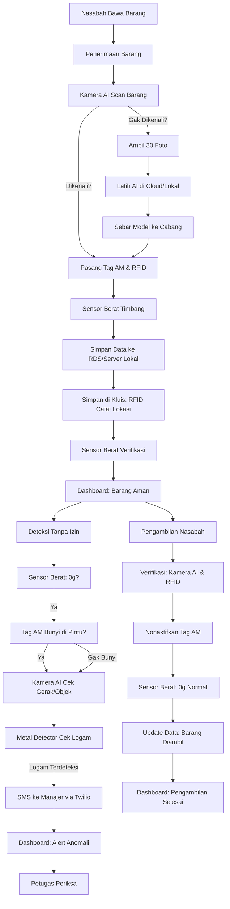

# Simulasi Contoh Kasus: Entitas Vault Security System - Pegadaian (EVSS-Pegadaian)

Dokumen ini menyajikan simulasi kasus nyata untuk menunjukkan cara kerja **Entitas Vault Security System - Pegadaian (EVSS-Pegadaian)** dalam mengamankan kluis di cabang Pegadaian. Sistem ini mengintegrasikan **EAS**, **RFID**, **Computer Vision**, **sensor tambahan** (load cell, metal detector), dan **IoT** untuk verifikasi barang, pelacakan lokasi, deteksi tanpa izin, dan notifikasi. Simulasi mencakup dua opsi implementasi: **berbasis cloud** dan **server lokal**, dengan fokus pada alur kerja di cabang dan akses data oleh kantor pusat.

## Konteks
- **Lokasi**: Cabang Pegadaian Surabaya 1, salah satu dari 1.000 cabang nasional.
- **Barang Gadai**: Cincin emas 24 karat (ITEM123), berat 5 gram, nilai Rp5 juta.
- **Pengguna**:
  - Karyawan cabang: Budi (operator kluis).
  - Manajer cabang: Anita.
  - Tim kantor pusat: Tim IT dan auditor.
- **Kebutuhan**:
  - Verifikasi keaslian cincin saat diterima dan dikembalikan.
  - Pelacakan lokasi cincin di kluis.
  - Deteksi jika cincin diambil tanpa izin.
  - Akses data real-time oleh kantor pusat via dashboard.

## Skenario Simulasi
Simulasi mencakup enam tahap: **Penerimaan Barang**, **Penyimpanan**, **Upaya Pengambilan Tanpa Izin**, **Pengambilan oleh Nasabah**, **Kerusakan Peralatan**, dan **Kesalahan Input Data**. Setiap tahap dijelaskan untuk opsi **cloud** dan **lokal**.

---

### Opsi 1: Implementasi Berbasis Cloud

#### Tahap 1: Penerimaan Barang (10:00 WIB, 28 Mei 2025)
- **Konteks**: Nasabah datang menyerahkan cincin emas (ITEM123) untuk gadai.
- **Alur Kerja**:
  1. **Verifikasi Barang**:
     - Budi scan cincin dengan kamera HD di stasiun verifikasi.
     - Model AI (YOLOv8) konfirmasi: “Cincin emas 24K, 82% kecocokan.”
     - Budi timbang cincin dengan sensor load cell: 5,02 gram.
  2. **Pemberian Tag**:
     - Budi tempel tag AM (EAS) dan tag UHF (RFID) pada cincin.
     - RFID simpan data: `{item_id: "ITEM123", branch_id: "SBY1", description: "Cincin emas 24K, 5g", status: "Gadai"}`, dienkripsi AES-256.
  3. **Penyimpanan Data**:
     - Raspberry Pi kirim data ke AWS IoT Core.
     - Data disimpan di PostgreSQL (AWS RDS read replica di cabang Surabaya).
     - Replikasi streaming kirim data ke RDS primary di kantor pusat.
  4. **Dashboard**:
     - Anita buka dashboard (`https://dashboard.evss-pegadaian.com`) di komputer, lihat: “ITEM123 diterima di SBY1, 10:00 WIB.”
     - Kantor pusat lihat data yang sama di dashboard pusat.
- **Output**:
  - Database: `INSERT INTO items (item_id, branch_id, description, status, location, timestamp) VALUES ('ITEM123', 'SBY1', 'Cincin emas 24K, 5g', 'Gadai', 'Verifikasi', '2025-05-28 10:00:00');`
  - Notifikasi: Email ke Anita, “Barang baru: ITEM123 diterima.”

#### Tahap 2: Penyimpanan (10:15 WIB)
- **Konteks**: Cincin disimpan di kluis kompartemen A-12.
- **Alur Kerja**:
  1. **Pelacakan Lokasi**:
     - Budi masukkan cincin ke kompartemen A-12.
     - RFID reader di kompartemen deteksi tag UHF, update lokasi: “A-12”.
     - Sensor load cell catat berat: 5,02 gram.
  2. **Sinkronisasi Data**:
     - Data dikirim via Raspberry Pi ke AWS IoT Core, lalu ke RDS.
     - Update database: `UPDATE items SET location = 'A-12' WHERE item_id = 'ITEM123';`
  3. **Dashboard**:
     - Anita lihat di dashboard: “ITEM123 di A-12, SBY1, berat 5,02g.”
     - Kantor pusat lihat status serupa.
- **Output**:
  - Database: Lokasi ITEM123 diperbarui.
  - Log: “ITEM123 dipindahkan ke A-12, 10:15 WIB.”

#### Tahap 3: Upaya Pengambilan Tanpa Izin (14:00 WIB)
- **Konteks**: Seseorang coba ambil cincin dari A-12, sembunyikan di wadah logam.
- **Alur Kerja**:
  1. **Deteksi Awal**:
     - Sensor load cell di A-12 deteksi berat turun dari 5,02g ke 0g.
     - RFID reader gagal deteksi tag (diblokir wadah logam).
  2. **Pintu Kluis**:
     - Antena EAS deteksi tag AM aktif, picu sirene.
     - Kamera AI deteksi “wadah logam mencurigakan” (YOLOv8, 75% confidence).
     - Metal detector di pintu konfirmasi logam, picu alarm tambahan.
  3. **Notifikasi**:
     - Raspberry Pi kirim alert ke AWS IoT Core.
     - Twilio kirim SMS ke Anita: “ITEM123 hilang dari A-12, SBY1, wadah logam terdeteksi, 14:00 WIB.”
     - Kantor pusat terima notifikasi serupa via email.
  4. **Dashboard**:
     - Anita lihat alert merah: “Anomali: ITEM123 hilang, periksa pintu kluis.”
     - Kantor pusat lihat footage kamera di dashboard.
- **Output**:
  - Database: `INSERT INTO logs (item_id, branch_id, event, timestamp) VALUES ('ITEM123', 'SBY1', 'Anomali: Berat 0g, EAS aktif', '2025-05-28 14:00:00');`
  - Aksi: Budi hentikan pelaku, periksa wadah.

#### Tahap 4: Pengambilan oleh Nasabah (16:00 WIB)
- **Konteks**: Nasabah lunasi gadai, ambil cincin.
- **Alur Kerja**:
  1. **Verifikasi**:
     - Budi scan RFID: Konfirmasi “ITEM123, status: Lunas.”
     - Kamera AI verifikasi: “Cincin emas 24K, cocok.”
  2. **Pengambilan**:
     - Budi nonaktifkan tag AM dengan demagnetisasi.
     - Cincin diambil, sensor load cell catat berat 0g.
  3. **Update Data**:
     - Data dikirim ke RDS via AWS IoT Core.
     - Update: `UPDATE items SET status = 'Diambil', location = 'Keluar' WHERE item_id = 'ITEM123';`
  4. **Dashboard**:
     - Anita lihat: “ITEM123 diambil nasabah, SBY1, 16:00 WIB.”
     - Kantor pusat lihat laporan serupa.
- **Output**:
  - Database: Status ITEM123 diperbarui.
  - Notifikasi: Email ke Anita, “ITEM123 diambil.”

#### Tahap 5: Kerusakan Peralatan (09:00 WIB, 29 Mei 2025)
- **Konteks**: Kamera AI mati karena listrik down di Surabaya 1.
- **Alur Kerja**:
  1. **Deteksi Masalah**:
     - Raspberry Pi kirim alert: “Kamera offline, SBY1, 09:00 WIB.”
     - Dashboard lihat status: “Kamera AI gagal, gunakan prosedur manual.”
  2. **Penanganan Manual**:
     - Budi input data cincin baru (ITEM456, gelang emas, 15g) di dashboard: `item_id: "ITEM456", description: "Gelang emas, 15g", status: "Gadai"`.
     - Pasang tag AM dan RFID, sensor load cell verifikasi: 15g.
  3. **Penyimpanan Data**:
     - Data disimpan di RDS (cloud) meski tanpa AI.
     - Kantor pusat diberi tahu via email: “Data manual ITEM456, kamera offline.”
  4. **Perbaikan**:
     - Teknisi cek listrik, nyala lagi pukul 09:30 WIB.
     - Kamera AI aktif kembali, verifikasi ulang ITEM456.
- **Output**:
  - Database: `INSERT INTO items ...` untuk ITEM456.
  - Log: “Kamera offline 09:00-09:30 WIB, perbaikan selesai.”

#### Tahap 6: Kesalahan Input Data (10:30 WIB)
- **Konteks**: Budi salah input berat ITEM123 jadi 50g (harusnya 5g).
- **Alur Kerja**:
  1. **Deteksi Kesalahan**:
     - Sensor load cell di A-12 catat 5,02g, beda sama data dashboard (50g).
     - Alert muncul: “Data berat gak cocok, cek ulang!”
  2. **Koreksi**:
     - Anita buka dashboard, minta Budi periksa.
     - Budi ubah data: `UPDATE items SET berat = 5 WHERE item_id = 'ITEM123';`.
  3. **Sinkronisasi**:
     - Data diperbarui di RDS, notifikasi ke kantor pusat.
  4. **Dashboard**:
     - Anita lihat: “ITEM123 berat diperbaiki ke 5g, 10:30 WIB.”
- **Output**:
  - Database: Berat ITEM123 diperbarui.
  - Log: “Koreksi berat ITEM123, 10:30 WIB.”

---

### Opsi 2: Implementasi Tanpa Cloud (Server Lokal)

#### Tahap 1: Penerimaan Barang (10:00 WIB, 28 Mei 2025)
- **Konteks**: Sama seperti cloud, nasabah serahkan cincin (ITEM123).
- **Alur Kerja**:
  1. **Verifikasi Barang**:
     - Budi scan cincin dengan kamera, YOLOv8 konfirmasi: “Cincin emas 24K.”
     - Sensor load cell catat: 5,02 gram.
  2. **Pemberian Tag**:
     - Tag AM dan UHF dipasang, data RFID dienkripsi AES-256.
  3. **Penyimpanan Data**:
     - Raspberry Pi kirim data ke server lokal cabang (PC Ubuntu).
     - Data disimpan di PostgreSQL lokal: `INSERT INTO items ...` (sama seperti cloud).
     - Server cabang replikasi data ke server pusat via VPN (OpenVPN).
  4. **Dashboard**:
     - Anita buka dashboard di komputer lokal (`http://192.168.1.100:5000`), lihat: “ITEM123 diterima.”
     - Kantor pusat buka dashboard pusat (`http://pusat.pegadaian.local:5000`) via VPN.
- **Output**:
  - Database: Data ITEM123 tersimpan.
  - Notifikasi: Email ke Anita (via Twilio, butuh internet untuk ini).

#### Tahap 2: Penyimpanan (10:15 WIB)
- **Konteks**: Cincin ke kompartemen A-12.
- **Alur Kerja**:
  1. **Pelacakan Lokasi**:
     - RFID reader deteksi tag di A-12.
     - Sensor load cell konfirmasi berat.
  2. **Sinkronisasi Data**:
     - Data disimpan di server lokal cabang, replikasi ke pusat via VPN.
     - Update: `UPDATE items SET location = 'A-12' ...`
  3. **Dashboard**:
     - Anita lihat di dashboard lokal: “ITEM123 di A-12.”
     - Kantor pusat lihat via VPN.
- **Output**:
  - Database: Lokasi diperbarui.
  - Log: “ITEM123 di A-12.”

#### Tahap 3: Upaya Pengambilan Tanpa Izin (14:00 WIB)
- **Konteks**: Cincin disembunyikan di wadah logam.
- **Alur Kerja**:
  1. **Deteksi Awal**:
     - Sensor load cell deteksi berat 0g.
     - RFID reader gagal deteksi tag.
  2. **Pintu Kluis**:
     - Antena EAS picu sirene.
     - Kamera AI deteksi wadah logam.
     - Metal detector picu alarm.
  3. **Notifikasi**:
     - Raspberry Pi kirim alert ke server lokal.
     - Twilio kirim SMS ke Anita (jika internet tersedia).
     - Jika offline, alert disimpan lokal, disinkronkan saat online.
  4. **Dashboard**:
     - Anita lihat alert di dashboard lokal.
     - Kantor pusat lihat via VPN setelah sinkronisasi.
- **Output**:
  - Database: Log anomali.
  - Aksi: Budi periksa pelaku.

#### Tahap 4: Pengambilan oleh Nasabah (16:00 WIB)
- **Konteks**: Nasabah ambil cincin.
- **Alur Kerja**:
  1. **Verifikasi**:
     - RFID konfirmasi “Lunas,” AI verifikasi cincin.
  2. **Pengambilan**:
     - Tag AM dinonaktifkan.
     - Sensor load cell catat 0g.
  3. **Update Data**:
     - Data disimpan di server lokal, replikasi ke pusat.
     - Update: `UPDATE items SET status = 'Diambil' ...`
  4. **Dashboard**:
     - Anita lihat di dashboard lokal: “ITEM123 diambil.”
     - Kantor pusat lihat via VPN.
- **Output**:
  - Database: Status diperbarui.
  - Notifikasi: Email ke Anita.

#### Tahap 5: Kerusakan Peralatan (09:00 WIB, 29 Mei 2025)
- **Konteks**: Kamera AI mati karena listrik down.
- **Alur Kerja**:
  1. **Deteksi Masalah**:
     - Raspberry Pi kirim alert: “Kamera offline, SBY1, 09:00 WIB.”
     - Dashboard lokal lihat: “Kamera AI gagal.”
  2. **Penanganan Manual**:
     - Budi input data ITEM456 (gelang emas, 15g) di dashboard: `item_id: "ITEM456", description: "Gelang emas, 15g"`.
     - Pasang tag AM/RFID, sensor load cell verifikasi: 15g.
  3. **Penyimpanan Data**:
     - Data disimpan di server lokal, replikasi ke pusat via VPN.
  4. **Perbaikan**:
     - Teknisi cek listrik, nyala lagi pukul 09:30 WIB.
     - Kamera aktif kembali, verifikasi ulang.
- **Output**:
  - Database: Data ITEM456 tersimpan.
  - Log: “Kamera offline 09:00-09:30 WIB.”

#### Tahap 6: Kesalahan Input Data (10:30 WIB)
- **Konteks**: Budi salah input berat ITEM123 jadi 50g.
- **Alur Kerja**:
  1. **Deteksi Kesalahan**:
     - Sensor load cell catat 5,02g, beda sama dashboard (50g).
     - Alert: “Data berat gak cocok!”
  2. **Koreksi**:
     - Anita minta Budi periksa, ubah data: `UPDATE items SET berat = 5 WHERE item_id = 'ITEM123';`.
  3. **Sinkronisasi**:
     - Data diperbarui di server lokal, replikasi ke pusat.
  4. **Dashboard**:
     - Anita lihat: “ITEM123 berat diperbaiki ke 5g.”
- **Output**:
  - Database: Berat diperbarui.
  - Log: “Koreksi berat ITEM123.”

---

## Perbedaan Utama
| **Aspek**                | **Cloud**                              | **Lokal**                              |
|--------------------------|----------------------------------------|----------------------------------------|
| **Sinkronisasi Data**    | Replikasi streaming ke AWS RDS         | Replikasi via VPN ke server pusat      |
| **Akses Dashboard**      | Publik (`https://...`)                | Lokal/VPN (`http://192.168...`)        |
| **Notifikasi**           | Real-time via Twilio                  | Real-time jika online, tertunda jika offline |
| **Kantor Pusat**         | Akses langsung via dashboard          | Akses via VPN, latensi mungkin         |

## Flowchart Sistem
Flowchart ini dibuat pake Mermaid, bisa dirender di [Mermaid Live Editor](https://mermaid.live/).

## Manfaat Simulasi
- **Kejelasan**: Menunjukkan alur kerja dari penerimaan hingga pengambilan.
- **Keamanan**: Deteksi penyembunyian dengan EAS, AI, dan metal detector.
- **Akses Pusat**: Kantor pusat pantau semua cabang (real-time di cloud, via VPN di lokal).
- **Fleksibilitas**: Mendukung cloud untuk skalabilitas atau lokal untuk kontrol.
