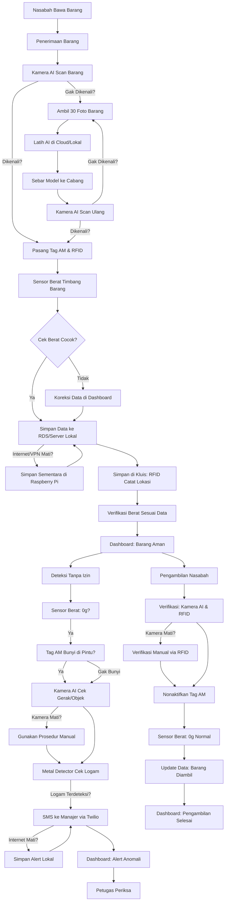

# Cara Kerja Sistem: Entitas Vault Security System - Pegadaian (EVSS-Pegadaian)

Dokumen ini menjelaskan cara kerja sistem keamanan kluis di cabang Pegadaian, dari teknologi yang dipake, integrasinya, sampe contoh kasus nyata. Sistem dirancang buat jaga barang gadai (misal, kalung, cincin) dengan **multi-layer alarm system**. Sistem ini pakai **UPS (Uninterruptible Power Supply)** di setiap cabang sebagai daya cadangan 30 menit, jaga operasional saat listrik mati (misal, buat Raspberry Pi, sensor, dan dashboard). Waktu pembuatan: **04:20 PM WIB, 29 Mei 2025**.

## 1. Penjelasan Per Item Teknologi yang Digunakan

### 1.1. EAS (Tag AM - Acousto-Magnetic)
- **Apa Itu**: Stiker kecil dipasang di barang gadai, pake getaran suara (58kHz) buat deteksi. Kalau dibawa keluar kluis tanpa izin, antena di pintu bunyikan alarm.
- **Fungsi**: Jaga barang dari pencurian, aktif sampe dinonaktifkan pake alat detacher.
- **Kelemahan**: Bisa terganggu logam tebal yang blokir getaran.
- **Harga**: ~Rp2.000 per tag, antena (misal, Sensormatic Synergy) ~Rp20 juta.
- **Contoh**: Tag AM di kalung ITEM456 bunyi kalau pelaku coba bawa keluar.

### 1.2. RFID (Radio Frequency Identification)
- **Apa Itu**: Tag kecil di barang yang nyimpen data (misal, `item_id: ITEM123, lokasi: A-12`) dan dikirim ke reader via gelombang radio (860-960 MHz).
- **Fungsi**: Lacak lokasi barang di kluis dan verifikasi identitas.
- **Kelemahan**: Sinyal bisa gak terbaca kalau ada logam tebal.
- **Harga**: Tag ~Rp500, reader (misal, Zebra FX9600, jarak baca 6-10 meter) ~Rp30 juta.
- **Contoh**: RFID catat kalung di A-12, gak terbaca kalau disembunyiin.

### 1.3. Computer Vision (Kamera AI)
- **Apa Itu**: Kamera HD (misal, Hikvision) pake AI (YOLOv8) buat kenali barang, gerak-gerik mencurigakan, atau objek dilarang (misal, kotak logam).
- **Fungsi**: Verifikasi barang, deteksi anomali visual, dan tambah barang baru pake foto.
- **Kelemahan**: Gak lihat kalau barang disembunyiin (misal, di kantong).
- **Harga**: ~Rp3 juta per kamera.
- **Contoh**: AI bilang “Kalung emas, 99%” atau “Kotak logam terdeteksi.”

### 1.4. Sensor Berat (Load Cell)
- **Apa Itu**: Alat kecil di kompartemen kluis yang timbang barang (misal, 5g).
- **Fungsi**: Deteksi kalau barang diambil (berat jadi 0g).
- **Kelemahan**: Gak tahu apa yang diambil, cuma deteksi perubahan berat.
- **Harga**: ~Rp150.000 per unit.
- **Contoh**: Sensor di A-12 deteksi 0g, kirim peringatan.

### 1.5. Metal Detector
- **Apa Itu**: Alat di pintu kluis yang deteksi benda logam (misal, kotak logam).
- **Fungsi**: Jaga kalau barang disembunyiin di logam, bunyikan alarm.
- **Kelemahan**: Bisa salah deteksi (false positive) kalau sensitivitas tinggi.
- **Harga**: Rp15 juta - Rp75 juta (misal, Garrett PD 6500i).
- **Contoh**: Deteksi kotak logam di kantong pelaku.

### 1.6. IoT (Raspberry Pi)
- **Apa Itu**: Komputer kecil yang nyambungin semua alat (kamera, RFID, sensor) ke jaringan.
- **Fungsi**: Kumpulin data, kirim ke cloud (RDS) atau server lokal, dan aktifin alarm.
- **Kelemahan**: Butuh koneksi stabil (cloud) atau VPN (lokal).
- **Harga**: ~Rp1 juta per unit.
- **Contoh**: Raspberry Pi kirim SMS ke manajer via Twilio.

### 1.7. Gudang Data
- **Cloud (RDS)**: Layanan Amazon (PostgreSQL) simpen data di cloud, akses cepet dari pusat.
- **Lokal**: Server cabang (PC Ubuntu, RAM 16GB) simpen data, sinkron ke pusat via VPN.
- **Fungsi**: Pantau status barang semua cabang.
- **Contoh**: RDS catat “ITEM123 di A-12” atau server lokal update lokasi.

## 2. Integrasi Teknologi yang Digunakan

### 2.1. Alur Integrasi
Semua teknologi ini kerja bareng dalam **multi-layer alarm system**, dikontrol pake **Raspberry Pi** dan ditampilkan di **dashboard**.

- **Penerimaan Barang**:
  - Kamera AI scan barang, RFID dan tag AM dipasang, sensor berat timbang.
  - Data dikirim ke Raspberry Pi, disimpen di RDS (cloud) atau server lokal.
  - Dashboard konfirmasi: “ITEM123 diterima.”
  - Kalau internet (cloud) atau VPN (lokal) mati, Raspberry Pi simpan data sementara di memori internal (SQLite), sinkron pas koneksi balik.

- **Simpan di Kluis**:
  - RFID catat lokasi (misal, A-12), sensor berat verifikasi.
  - Raspberry Pi update data ke cloud atau lokal.
  - Dashboard pantau: “ITEM123 aman di A-12.”
  - Kalau internet/VPN mati, data disimpan sementara, sinkron pas online.

- **Deteksi Tanpa Izin**:
  - Sensor berat deteksi 0g, kirim ke Raspberry Pi.
  - Tag AM bunyi di pintu, kamera AI cek gerak/objek, metal detector deteksi logam.
  - Kalau kamera mati (listrik down), pake prosedur manual (RFID dan metal detector).
  - Raspberry Pi kirim SMS (Twilio) dan update dashboard.
  - **Cloud**: Data ke RDS, pusat lihat real-time.
  - **Lokal**: Data ke server, sinkron ke pusat via VPN.
  - Kalau internet mati, alert disimpan lokal, sinkron pas online.

- **Tambah Barang Baru**:
  - Kamera AI gak kenal barang, Budi ambil 30 foto.
  - Raspberry Pi kirim data ke server pusat.
  - **Cloud**: AWS EC2 latih AI, model disebar via S3.
  - **Lokal**: Server pusat latih, model disebar via rsync.
  - Kamera AI di cabang scan ulang barang pake model baru.
  - Kalau dikenali (misal, 95% confidence), pasang tag AM dan RFID, lanjut ke penyimpanan.
  - Dashboard konfirmasi: “Model_v2 aktif, ITEM456 dikenali.”
  - Kalau internet mati, data disimpan sementara, sinkron pas online.

- **Pengambilan Nasabah**:
  - Kamera AI dan RFID verifikasi, tag AM dinonaktifkan.
  - Sensor berat cek 0g (normal), data update.
  - Kalau kamera mati, verifikasi manual via RFID.
  - Dashboard catat: “ITEM123 diambil.”
  - Kalau internet/VPN mati, data disimpan sementara, sinkron pas online.

### 2.2. Keunggulan Integrasi
- **Multi-Layer**: Kalau satu gagal (misal, tag AM terganggu), yang lain (metal detector) tetep jaga.
- **Real-Time**: Data langsung ke pusat (cloud) atau sinkron (lokal).
- **Fleksibel**: Bisa tambah barang baru pake foto.

## 3. Beberapa Contoh Kasus

### 3.1. Kasus 1: Penerimaan Barang Baru (Kalung Custom)
- **Konteks**: Nasabah bawa kalung custom (ITEM456), 10g, di Surabaya 1, 10:05 WIB, 29 Mei 2025.
- **Keadaan**:
  - Kamera AI bilang: “Gak dikenali, 45%.”
  - Budi ambil 30 foto, pasang tag AM/RFID, sensor berat: 10g.
  - Data ke RDS (cloud) atau server lokal.
- **Proses**:
  - AI dilatih 1-2 jam di cloud (AWS) atau server pusat.
  - Model_v2 disebar ke 1.000 cabang.
  - Kamera AI scan ulang, konfirmasi 97%.
- **Hasil**: Dashboard lihat: “ITEM456 dikenali, 97%,” kalung simpan di A-13.

### 3.2. Kasus 2: Pencurian dengan Kotak Logam
- **Konteks**: Pelaku ambil kalung ITEM456 dari A-13, sembunyiin di kotak logam, 10:10 WIB, 29 Mei 2025.
- **Keadaan**:
  - Sensor berat: 0g.
  - RFID: Gak terbaca.
  - Tag AM: Terganggu, gak bunyi.
  - Kamera AI: Gak lihat, kotak di kantong.
  - Metal Detector: Deteksi logam, alarm bunyi (ditenagai UPS).
- **Proses**:
  - Raspberry Pi (ditenagai UPS) kirim SMS ke Anita: “Logam terdeteksi!”
  - Kalau kamera mati, metal detector tetep aktif.
  - Budi periksa, temuin kotak.
- **Hasil**: Kalung kembali ke A-13, data update di RDS atau server lokal.

### 3.3. Kasus 3: Pengambilan Nasabah
- **Konteks**: Nasabah ambil kalung ITEM123 setelah lunas, 10:15 WIB, 29 Mei 2025.
- **Keadaan**:
  - Budi cek RFID: “ITEM123, siap ambil.”
  - Kamera AI: “Kalung emas, 99%.”
  - Tag AM dinonaktifkan pake detacher.
  - Sensor berat: 0g (normal).
- **Proses**:
  - Budi serahin barang, data update ke RDS atau server lokal.
- **Hasil**: Dashboard catat: “ITEM123 diambil, 10:15 WIB.”

### 3.4. Kasus 4: Kerusakan Peralatan (Kamera AI Mati)
- **Konteks**: Kamera AI di Surabaya 1 mati karena listrik down, 10:20 WIB, 29 Mei 2025.
- **Keadaan**:
  - Kamera gak bisa scan barang baru (ITEM789, gelang emas).
  - Raspberry Pi (ditenagai UPS) kirim alert: “Kamera offline, gunakan prosedur manual.”
- **Proses**:
  - Budi input data manual di dashboard (ditenagai UPS): `item_id: ITEM789, jenis: Gelang emas, berat: 15g`.
  - Pasang tag AM dan RFID, sensor berat verifikasi: 15g.
  - Data disimpen sementara di Raspberry Pi (offline), sinkron ke RDS/server lokal pas kamera nyala.
  - Teknisi ganti kabel, kamera nyala lagi (30 menit).
- **Hasil**: Dashboard catat: “ITEM789 disimpan tanpa AI, teknisi selesai 10:50 WIB.”

### 3.5. Kasus 5: Kesalahan Input Data oleh Karyawan
- **Konteks**: Budi salah input berat kalung (ITEM234) jadi 50g (harusnya 5g), 10:25 WIB, 29 Mei 2025.
- **Keadaan**:
  - Sensor berat di A-14 (ditenagai UPS) deteksi 5g, beda sama data input (50g).
  - Alert muncul di dashboard: “Data berat gak cocok, cek ulang!”
- **Proses**:
  - Anita buka dashboard, lihat peringatan.
  - Budi koreksi data: `UPDATE items SET berat = 5 WHERE item_id = 'ITEM234';`.
  - Data update di RDS/server lokal.
- **Hasil**: Dashboard konfirmasi: “ITEM234 data diperbaiki, berat: 5g.”

## 4. Flowchart Sistem
Flowchart ini dibuat pake Mermaid, bisa dirender di [Mermaid Live Editor](https://mermaid.live/) atau GitHub.

